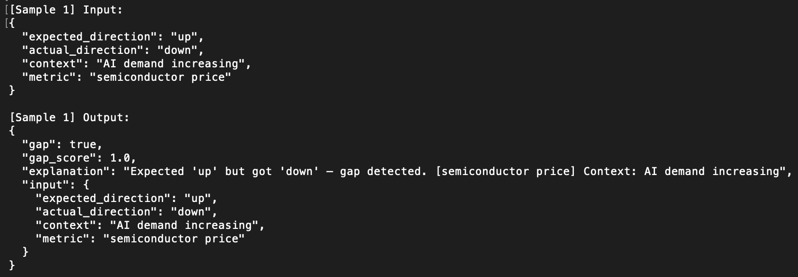

# PhantomQuant

Detecting structural gaps between expectation and reality.

Lightweight gap detection engine for:
- market analysis
- AI output verification
- runtime inconsistency detection
- anomaly research

---

## Problem

Modern systems often fail silently.

Expected outcomes and actual outcomes diverge,
but most systems only monitor results.

Examples:
- AI demand increases, but semiconductor prices fall
- AI output appears correct, but internal reasoning is inconsistent
- Systems pass tests but fail in production

PhantomQuant focuses on detecting these structural gaps.

---

## Core Concept

PhantomQuant compares:

- expected direction
- actual direction

and detects inconsistencies between them.

The goal is not prediction.

The goal is detecting when reality diverges from expectation.

---

## Example Input

```json
{
  "expected_direction": "up",
  "actual_direction": "down",
  "context": "AI demand increasing",
  "metric": "semiconductor price"
}
```

---

## Example Output

```json
{
  "gap": true,
  "gap_score": 1.0,
  "explanation": "Expected 'up' but actual was 'down'. Structural inconsistency detected."
}
```

---

## Run

```bash
python3 main.py --demo
```

---

## Demo Screenshot



---

## Use Cases

- Market analysis
- AI output verification
- Runtime verification
- Security anomaly detection
- BugBounty research

---

## Philosophy

The important question is not:

"Is it correct?"

but:

"Is it structurally consistent?"

---

## Loom Demo

Watch the 3-minute demo here:

https://www.loom.com/share/2fef44eecdaf4c2eb6cd5dedc2599c07
